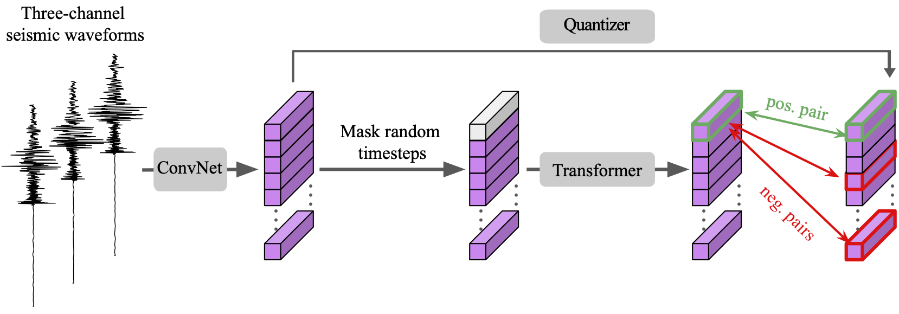

# Seismic LM: A foundation model for seismic waveforms


This repository contains the code for training and fine-tuning the Seismic LM model, a transformer-based language model for seismic waveforms.

The model is based on the [Wav2Vec2](https://arxiv.org/abs/2006.11477) and is trained on [SeisBench](https://github.com/seisbench/seisbench), a large collection of seismic waveforms. The model can be used for various tasks in seismology, including waveform classification, phase picking, and event detection.



## Colab demo

| Examples                                         |  |
|--------------------------------------------------|---|
| Visualize SeisLM base pretrained features                                   | [](https://colab.research.google.com/github/liutianlin0121/seisLM/blob/main/examples/demo_seislm_visualized_pretrained_features.ipynb) |
| Finetune SeisLM base on foreshock-aftershock task                                   | [](https://colab.research.google.com/github/liutianlin0121/seisLM/blob/main/examples/demo_seislm_foreshock_aftershock_classification.ipynb) |


## Installation

To install the Seismic LM model, you can use the following command:

```bash
conda create -n seislm python=3.9 -y
source activate seislm

# Install necessary dependencies
conda install pytorch torchvision torchaudio pytorch-cuda=11.8 -c pytorch -c nvidia -y
pip install seisbench ml-collections pandas scikit-learn transformers einops gitpython wandb lightning torchtune

# Clone the SeisLM repo and install it
git clone https://github.com/liutianlin0121/seisLM.git
cd seisLM
pip install -e .
```
